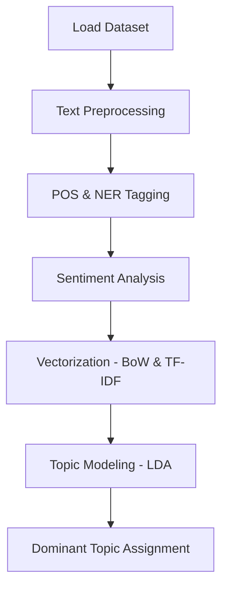

# 🏨 NLP End-to-End Hotel Review Analysis

### Text Cleaning • Tokenization • POS/NER • Sentiment Analysis • Topic Modeling • Vectorization

This project is a complete **Natural Language Processing (NLP) pipeline** built using Python.  
It processes **TripAdvisor hotel reviews** and performs:

✔ Text Preprocessing  
✔ Stopword Removal  
✔ Lemmatization & Stemming  
✔ POS Tagging  
✔ Named Entity Recognition  
✔ Sentiment Analysis (VADER)  
✔ Bag of Words  
✔ TF-IDF  
✔ Topic Modeling (LDA)  
✔ Dominant Topic Extraction

---

## 🚀 **Project Workflow**

